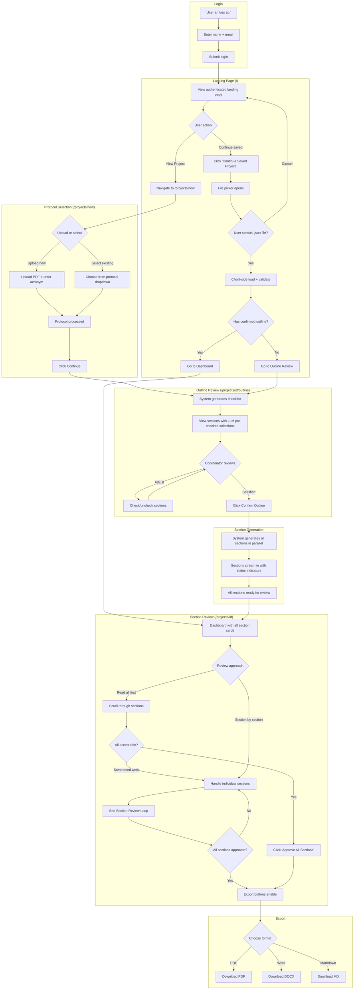
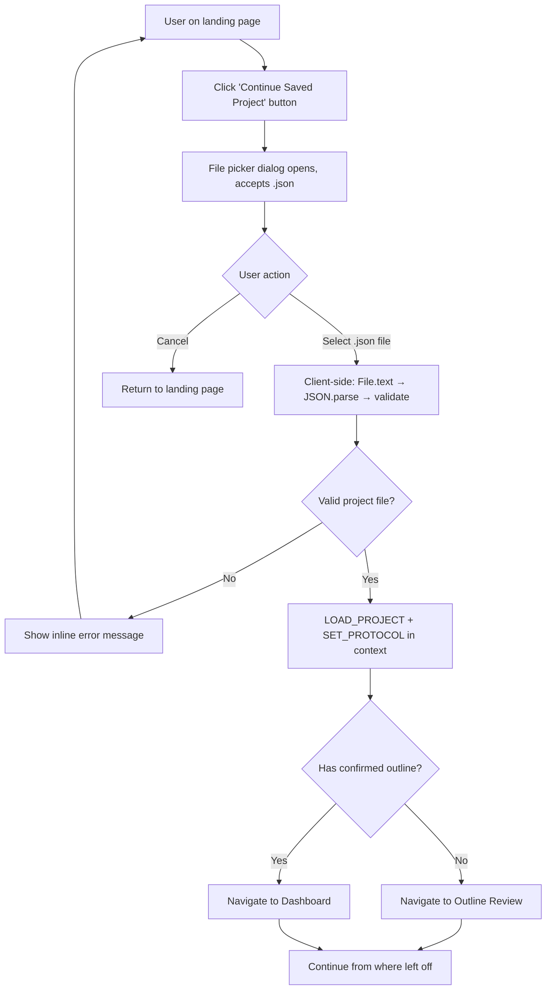
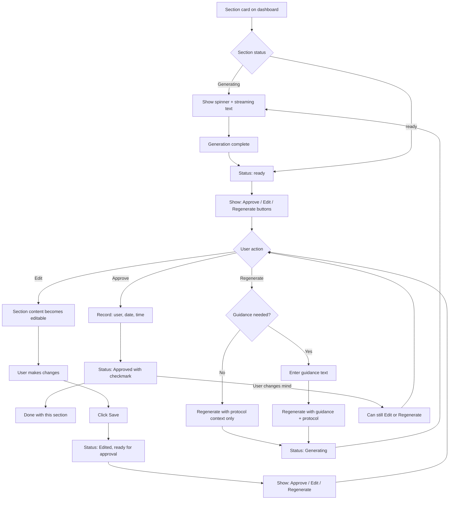

# UX Design Specification: bmad-simple-app

**Author:** Mikey
**Date:** 2026-02-03

---

## Executive Summary

### Project Vision

bmad-simple-app transforms clinical trial ICF creation from a weeks-long manual process into an hours-long AI-assisted review workflow. Research coordinators upload clinical protocol PDFs, and the system uses RAG-based retrieval to generate section-by-section ICF content. The human-in-the-loop approval model maintains regulatory accountability while dramatically reducing time-to-completion.

### Target Users

#### Primary: Research Coordinator

- Domain expert in regulatory compliance and IRB requirements
- Not expected to have medical training or AI prompt engineering skills
- Works across multiple concurrent clinical trials
- Uses desktop primarily, tablet/phone for review tasks

#### Secondary: DCC Supervisor

- Quality gate before PI submission
- Reviews and can edit completed ICFs

#### Downstream: Principal Investigator

- Receives ICF via email (does not interact with application)
- Reviews for medical accuracy and provides signature approval

### Key Design Challenges

1. **Multi-Step Workflow Clarity** - Protocol selection → outline review → section generation → review/approve → export. Each step has different interaction patterns; progress and next-actions must be obvious.

2. **Real-Time Streaming UX** - Sections generate in parallel with streaming text. Status must be glanceable across 10+ sections (generating → ready for review → approved).

3. **Human-in-the-Loop Without Friction** - Every section requires approval for regulatory accountability, but the workflow must feel efficient. "Approve All" for confidence, individual review when needed.

4. **Natural Language Input** - Outline corrections and regeneration guidance via free-text without requiring prompt engineering skills.

### Design Opportunities

1. **Smart Defaults with Override** - AI proposes outlines and generates content; humans always have final control. "AI drafts, human decides" feels empowering.

2. **Confidence Through Transparency** - Word counts, status badges, and approval tracking build trust in the regulated context.

3. **Minimal Clicks for Happy Path** - Most sections approved as-is. Edit and regenerate are escape hatches, not primary interactions.

4. **Extensible Document Type Selection** - Architecture supports future document types beyond ICF.

## Core User Experience

### Defining Experience

The core experience centers on **section-by-section review and approval**. Research coordinators spend most of their time reading AI-generated content and making approve/edit/regenerate decisions. The product succeeds when:

- Good sections are approved in one click
- Edits are made inline with clear save/approve flow
- Regeneration with guidance steers the AI effectively

### Platform Strategy

| Aspect | Decision |
|--------|----------|
| Platform | Web application (MPA with SPA-like dashboard) |
| Primary Device | Desktop workstation |
| Secondary Devices | Tablet (review), Phone (quick access) |
| Browsers | Chrome and Safari |
| Input | Mouse/keyboard primary; touch on mobile |
| Offline | Not required |

### Effortless Interactions

- **Approving a good section** - One click with instant visual feedback
- **Scanning section status** - Glanceable icons and badges across all sections
- **Editing content** - Inline text editing with clear Save → Approve flow
- **Exporting final ICF** - All formats (PDF, Word, Markdown) available once all sections approved

### Critical Success Moments

1. **First section streams in** - User sees real-time progress, builds confidence
2. **Reading generated content** - Quality matches or exceeds manual drafting
3. **Clicking Approve** - Satisfying confirmation of progress
4. **All sections approved** - Export buttons enable; accomplishment achieved
5. **PI approves ICF** - Minimal revisions validate the tool's value

### Experience Principles

1. **Approve is the Happy Path** - Most sections approved as-is. Edit and Regenerate are escape hatches, not primary flows.

2. **Progressive State, Clear Actions** - Each section shows exactly one primary action based on state:
   - generating → [spinner/skeleton, all actions disabled]
   - ready → [Approve] [Edit] [Regenerate]
   - editing → [Save] [Cancel]
   - edited → [Approve] [Edit] [Regenerate]
   - approved → [Edit] [Regenerate] (can revise if needed)

3. **AI Drafts, Human Decides** - System proposes; coordinator disposes. Every section requires explicit human approval.

4. **Streaming Builds Confidence** - Real-time text generation shows the system working, not a black box.

5. **Responsive Without Compromise** - Full workflow available on any device; section cards adapt without losing functionality.

## Desired Emotional Response

### Primary Emotional Goals

**Empowered Efficiency** - Coordinators should feel they have a capable assistant handling the hard part (medical translation), leaving them to apply their expertise (regulatory compliance, patient-appropriate language).

Supporting emotions:

- **Confidence** - "This content is accurate; I can send it to the PI"
- **Control** - "I can approve, edit, or regenerate any section"
- **Momentum** - "I'm making real progress with every approval"
- **Relief** - "I don't have to write this from scratch anymore"

### Emotional Journey Mapping

| Moment | Desired Emotion | Design Implication |
|--------|-----------------|-------------------|
| Login | Calm, ready | Clean, professional interface |
| Protocol upload | Anticipation | Clear feedback during processing |
| Outline review | In control | Can adjust before committing |
| Generation starts | Excitement | Streaming shows visible progress |
| Reading first section | Impressed | Quality exceeds expectations |
| Approving sections | Satisfaction | Instant visual feedback |
| Bad section encountered | Not worried | Easy edit/regenerate escape hatch |
| All sections approved | Accomplishment | Clear celebration moment |
| Export complete | Pride | Ready to send to PI confidently |

### Micro-Emotions

| Cultivate | Prevent |
|-----------|---------|
| Confidence → Trust the output | Skepticism → "Is this right?" |
| Accomplishment → Progress visible | Frustration → Stuck or confused |
| Control → Can always override AI | Helplessness → AI decides for me |
| Efficiency → Fast workflow | Tedium → Too many clicks |

### Emotional Design Principles

1. **Progress Over Perfection** - Show momentum constantly. Every approval is visible progress. Never let users feel stuck.

2. **Control Without Burden** - AI does heavy lifting; human is always in charge. Override is easy, not an emergency.

3. **Trust Through Transparency** - Word counts, clear status, streaming generation. No black boxes.

4. **Celebrate Completion** - When all sections approved, make it feel like an accomplishment.

## UX Pattern Analysis & Inspiration

### Design Philosophy

bmad-simple-app is a **task-focused utility**, not a platform. Research coordinators already use numerous applications with love-hate relationships. This tool succeeds by being straightforward, transparent, and quick to complete.

**What This App Is:**

- Task-focused tool: get in → generate ICF → get out
- Transparent about what it's doing at every step
- Professional utility for regulated work environment
- Minimal learning curve, self-evident interface

**What This App Is NOT:**

- Another complex system to master
- A place users spend hours daily
- Clever or surprising (users want predictable)
- Feature-rich to the point of confusion

### Anti-Patterns to Avoid

| Anti-Pattern | Why It's Bad | Our Approach |
|--------------|--------------|--------------|
| Feature bloat | Overwhelming, hard to find what you need | Single-purpose screens |
| Hidden functionality | "Where did that button go?" | Visible, predictable actions |
| Engagement tricks | Notifications, badges, gamification | None - tool, not game |
| Complex navigation | Multiple levels, hamburger menus | Linear workflow, clear back |
| Onboarding wizards | Users just want to do the task | Self-evident interface |
| Clever micro-interactions | Distracting, unprofessional | Straightforward feedback |

### Transferable Principles

1. **Single-Purpose Screens** - Each screen does one thing. Protocol selection. Outline review. Section dashboard. Export.

2. **Visible State** - Everything on the surface. No hidden menus, no "advanced" modes.

3. **Linear Workflow** - Clear progression. Users always know where they are and what's next.

4. **Immediate Feedback** - Click approve → section shows approved. No mystery.

5. **Professional Aesthetic** - Clean, calm, trustworthy. Healthcare-appropriate color palette.

### Approval Tracking Requirements

Simple documentation, not complex workflow:

- Each section records: approver name, date, timestamp
- Multiple users can approve different sections on the same project
- All approvers logged and printed on final ICF page
- No approval hierarchy or routing - just transparent record-keeping

## Design System Foundation

### Design System Choice

**Tailwind CSS + Custom React Components** within a Next.js/TypeScript application.

### Technology Stack

| Layer | Choice |
|-------|--------|
| Framework | Next.js |
| Styling | Tailwind CSS (utility-first) |
| Components | Custom React components |
| Language | TypeScript |
| Deployment | Vercel-compatible |

### Rationale for Selection

1. **Prototype Proven** - Stack already validated through iterative prototype development
2. **Claude Code Friendly** - Utility classes and typed components work well with AI-assisted development
3. **No Library Conflicts** - Custom components avoid shadcn/Vercel compatibility issues
4. **Full Control** - No framework constraints on design or behavior
5. **Task-Focused** - Lightweight approach matches tool-not-platform philosophy

### Implementation Approach

- Build reusable components for repeated UI patterns
- Use Tailwind design tokens for consistent spacing, colors, typography
- Keep components single-purpose and composable
- TypeScript interfaces for all component props

### Component Library (To Build)

Core components needed:

- **Layout:** PageHeader, ActionBar
- **Forms:** LoginForm, ProtocolUpload (drag-and-drop + acronym input), ProtocolSelect (custom dropdown)
- **Feedback:** StatusIcon (colored circle with SVG icon), ApprovalBadge, BackendStatus, Spinner
- **Section Card:** The primary dashboard component (title, status icon, content, actions)
- **Outline:** OutlineChecklist, ConfirmButton
- **Modal:** RegenerateModal

### Color Strategy

Current purple/violet palette retained as starting point. Colors defined in Tailwind config for easy adjustment. Healthcare-appropriate: professional, calm, trustworthy.

## Defining User Experience

### The Defining Experience

**"Review AI-generated content and approve it in one click"**

The core interaction that defines bmad-simple-app: coordinators read AI-generated ICF sections and approve them with a single click. If content needs adjustment, they edit or regenerate. This is the loop that delivers value.

User description: "You upload the protocol, and it generates all the ICF sections. You just read through each one and click Approve. If something's wrong, you can edit it or have it regenerate. When you're done, you download the ICF."

### User Mental Model

**Current process (without tool):**

- Open blank document, read protocol, manually write patient-facing language
- Send to PI → wait → receive feedback → revise → repeat for weeks

**Mental model with tool:**

- "I'm the author, the AI is my assistant"
- "I need to verify everything before it goes to the PI"
- "This is my responsibility - I can't blindly trust AI"
- AI does hard part (medical translation); I do quality control (my expertise)

### Success Criteria

| Criteria | Definition |
|----------|------------|
| Instant comprehension | User reads section and immediately knows if it's good |
| One-click approval | If content is good, approve in single click |
| Easy escape hatch | If content is wrong, edit or regenerate without friction |
| Clear progress | Always know what's approved vs. pending |
| Confidence to send | When done, feel confident sending to PI |

### Pattern Analysis

Mostly established patterns with domain-specific application:

| Pattern | Type | Notes |
|---------|------|-------|
| Card-based content layout | Established | Common in dashboards |
| Approve/Edit/Regenerate actions | Established | Similar to PR review |
| Streaming text generation | Emerging | Users familiar from ChatGPT |
| Section-by-section review | Domain-specific | Matches consent document structure |

No major user education needed. Interaction model is intuitive: Read → Decide → Act.

### Experience Mechanics: The Section Card

**1. Initiation:**

- User arrives at dashboard after outline confirmed
- All sections generate in parallel
- Cards appear with streaming text and spinner

**2. Interaction (per section):**

- Generating: Spinner icon, text streaming, no actions
- Ready: Approve button appears (green), Edit and Regenerate available
- User reads and decides:
  - If good → Click Approve → checkmark, "Approved" status
  - If needs edit → Click Edit → text editable → Save → then Approve
  - If bad → Click Regenerate → optional guidance → new generation

**3. Feedback:**

- Status badge updates immediately
- Approved sections show green checkmark
- Word count displayed throughout
- "Approve All Sections" appears when all ready

**4. Completion:**

- All sections approved → Export buttons enable
- Download PDF, Word, or Markdown
- Send to PI. Done.

## Visual Design Foundation

### Color System

**Primary Palette:**

| Role | Color | Tailwind | Usage |
|------|-------|----------|-------|
| Primary | Purple/Violet | `violet-600` | Primary buttons, links, active states |
| Success | Green | `emerald-500` | Approve button, approved status, checkmarks |
| Warning | Amber | `amber-500` | Caution states |
| Error | Red | `red-500` | Error messages, destructive actions |
| Neutral | Slate | `slate-*` | Text, borders, backgrounds |

**Semantic Color Mapping:**

- **Approve action** → Green (success)
- **Edit action** → Neutral/outline (secondary)
- **Regenerate action** → Neutral/outline (secondary)
- **Export PDF** → Red (file type convention)
- **Export Word** → Blue (file type convention)
- **Export Markdown** → Teal (file type convention)
- **Status: Generating** → Amber/spinning
- **Status: Ready** → Neutral
- **Status: Approved** → Green with checkmark

### Typography System

**Font Stack:** Geist Sans (body) + Geist Mono (monospace), loaded via Next.js font optimization

**Type Scale:**

| Element | Size | Weight | Tailwind |
|---------|------|--------|----------|
| Page title | 24-32px | Bold | `text-2xl font-bold` |
| Section title | 18-20px | Semibold | `text-lg font-semibold` |
| Body text | 14-16px | Normal | `text-base` |
| Meta/small | 12-14px | Normal | `text-sm text-slate-500` |
| Button text | 14px | Medium | `text-sm font-medium` |

**Rationale:** Geist provides clean, modern typography optimized for Next.js. Users read substantial generated text; readability is critical.

### Spacing & Layout Foundation

**Base Unit:** 4px (Tailwind default)

| Token | Value | Tailwind | Usage |
|-------|-------|----------|-------|
| xs | 4px | `p-1` | Tight internal padding |
| sm | 8px | `p-2` | Button padding, tight gaps |
| md | 16px | `p-4` | Card padding, standard gaps |
| lg | 24px | `p-6` | Section spacing |
| xl | 32px | `p-8` | Page margins |

**Layout Principles:**

- Full-width on mobile, max-width container on desktop (1280px)
- Single column layout for section cards (vertical stack)
- Consistent card styling: rounded corners (`rounded-lg`), subtle border (`border-slate-200`), white background
- Generous whitespace between sections for scanability

### Accessibility Considerations

- **Contrast:** All text meets WCAG AA (4.5:1 minimum)
- **Focus states:** Visible ring on keyboard focus (`focus:ring-2`)
- **Status indication:** Icon + text + color (never color alone)
- **Touch targets:** Minimum 44x44px on mobile devices
- **No formal WCAG certification required** but best practices followed

## Design Direction

### Design Direction Decision

**Chosen Direction:** Existing prototype design (validated through iterative development)

The design direction is established through the working prototype, which has been refined over multiple iterations with Claude Code. Rather than exploring alternative visual approaches, we lock in this validated direction.

### Key Design Elements

**Layout Structure:**

- Single-column card stack for section content
- Full-width header with protocol context
- Action bar for bulk operations and export
- Generous whitespace for readability

**Card Design:**

- White background (`bg-white`)
- Rounded corners (`rounded-lg`)
- Subtle border (`border border-slate-200`), no shadow
- Status icon + section title in header, action buttons right-aligned
- Subtitle with word count and status label
- Content area with status-coded left border color

**Color Application:**

- Purple/violet for primary actions and interactive elements
- Green for approve actions and approved status
- Neutral/outline for secondary actions (Edit, Regenerate)
- Red/blue/teal for export buttons (matching file type conventions)

**Interaction Patterns:**

- Streaming text appears during generation
- Spinner indicates generating state
- Buttons enable progressively based on state
- Status badges update immediately on action

### Design Rationale

1. **Prototype Proven** - Design validated through real usage and iteration
2. **Task-Focused** - Clean layout keeps focus on content review
3. **Clear Hierarchy** - Section cards create scannable structure
4. **Progressive Disclosure** - Actions appear when relevant
5. **Professional Aesthetic** - Appropriate for healthcare/regulatory context

### Screens to Design

Building on the prototype direction, the following screens need design:

| Screen | Status | Notes |
|--------|--------|-------|
| Login | Done | Simple name + email entry on landing page |
| Landing Page | Done | New Project + Continue Saved Project actions |
| Protocol Selection | Done | Upload new or select existing protocol (separate page) |
| Outline Review | Done | AI-proposed checklist with confirm button |
| Section Dashboard | Done | Section cards with streaming, approve/edit/regenerate |
| Regenerate with Guidance | Done | Modal with optional guidance textarea |

## User Journey Flows

### New ICF Creation Flow



**Key Decision Points:**

- Landing page has two actions: New Project (goes to protocol selection page) or Continue Saved Project (file picker)
- Protocol selection page combines upload and existing selection on one screen (mutually exclusive — selecting one dims the other)
- "Continue Saved Project" opens file picker; cancel returns to landing page
- Loaded projects go to Dashboard if outline is confirmed, otherwise Outline Review
- All project file handling is client-side (no backend involved for save/load)
- Outline review uses checkbox list with LLM pre-selections (not free-text corrections)
- "Approve All Sections" is prominent for batch approval after read-through

### Resume/Continue Project Flow



**State Handling:**

- Projects can be resumed at any stage: outline review or section dashboard
- Project state is loaded entirely client-side via `readProjectFile()` — no backend involved
- `LOAD_PROJECT` action replaces entire ProjectState from the loaded file
- `SET_PROTOCOL` action restores protocol context (protocolId + protocolName)
- Dashboard restores to exact previous state (section content, statuses, approvals)
- User manages project files via their file system (shared folders, email, etc.)
- Version mismatch between saved file and current app shows a `window.alert()` warning

**File Format:**

- Project files use `.json` extension
- Contains all project state: protocol reference, outline, sections, approvals, metadata
- Human-readable JSON format for debugging if needed
- Validated client-side with `validateProjectFile()` before loading

### Section Review Loop



**Interaction States:**

- generating → ready → approved (happy path)
- Edit creates intermediate "editing" → "edited" state requiring explicit approval
- Approved sections can still be edited or regenerated if user changes mind
- Regenerate goes through "regenerating" status (distinct from initial "generating")

### Flow Optimization Principles

1. **Minimize decisions at entry** - Landing page shows context (existing projects visible) so "New vs Continue" is obvious, not a confusing forced choice

2. **Checklist over free-text for outline** - Structured checkbox list is faster and less error-prone than natural language corrections. LLM does the thinking; coordinator just validates.

3. **"Approve All" is the happy path** - Prominent placement assumes most sections are good. Individual approve buttons are escape hatches, not the primary flow.

4. **Read-first workflow** - Scroll through all → assess → batch approve. This matches how coordinators actually think: "Is this document ready?" not "Is section 1 ready?"

5. **State always visible** - Dashboard shows all sections at once so progress is glanceable. No hidden sections or pagination.

## Component Strategy

### Design System Components

Tailwind CSS provides design tokens (colors, spacing, typography, shadows) but no pre-built components. All components are custom-built using Tailwind utility classes within React/TypeScript.

**Available from Tailwind:**

- Color palette (violet, emerald, amber, red, slate)
- Typography scale (text-sm through text-2xl)
- Spacing scale (p-1 through p-8)
- Shadow utilities (shadow-sm, shadow)
- Border radius (rounded-lg)
- Responsive breakpoints (sm, md, lg)

### Custom Components

#### Section Card

**Purpose:** Display a single ICF section with its content, status, and available actions. This is the primary component users interact with on the dashboard.

**Usage:** Rendered in a vertical stack on the ICF Dashboard. One card per section (10-15 sections typical).

**Anatomy:**

```
┌─────────────────────────────────────────────────────────────┐
│ [StatusIcon]  Section Title        [Approve] [Edit] [Regen] │
│              N words · Status: label                        │
│ [ApprovalBadge: ✓ Approved by Name on Date]  (if approved) │
├─────────────────────────────────────────────────────────────┤
│ ┃                                                           │
│ ┃ Section content text...                                   │
│ ┃ (Streaming text appears here during generation)           │
│ ┃ (Editable textarea when in Edit mode)                     │
│ ┃ (Skeleton pulse bars when generating with no content yet) │
│ ┃                                                           │
│ (left border color-coded by status)         max-h-96 scroll │
└─────────────────────────────────────────────────────────────┘
```

**StatusIcon** is an 8×8 colored circle with a white SVG icon inside:

| Status | Color | Icon |
|--------|-------|------|
| generating | `bg-amber-400` | lightning bolt |
| regenerating | `bg-amber-400` | refresh arrows |
| ready | `bg-teal-500` | document |
| editing | `bg-blue-500` | pencil |
| edited | `bg-slate-400` | pencil |
| approved | `bg-emerald-500` | checkmark |
| error | `bg-red-500` | warning triangle |

**Content area left-border colors:** amber (generating/regenerating), slate (ready/edited), blue (editing), emerald (approved), red (error).

**States:**

| State | StatusIcon | Content Area | Actions Available |
|-------|------------|--------------|-------------------|
| Generating | Amber lightning | Skeleton pulse or streaming text | None (all disabled) |
| Ready | Teal document | Static text, not editable | Approve, Edit, Regenerate |
| Editing | Blue pencil | Editable textarea with blue focus ring | Save, Cancel |
| Edited | Slate pencil | Static text showing edits | Approve, Edit, Regenerate |
| Approved | Green checkmark | Static text + ApprovalBadge shown | Edit, Regenerate (can revise) |
| Regenerating | Amber refresh | Streaming new text | None (all disabled) |
| Error | Red warning | Error message in red text | Edit, Regenerate (no dedicated Retry) |

**Variants:** Single variant only — all cards always show full content (no collapsed/expanded toggle).

**Accessibility:**

- `role="article"` with `aria-labelledby` pointing to section title
- Status badge includes `aria-live="polite"` for state changes
- Approve button: `aria-label="Approve [Section Name]"`
- Edit button: `aria-label="Edit [Section Name]"`
- Regenerate button: `aria-label="Regenerate [Section Name]"`
- When editing: textarea has `aria-label="Edit content for [Section Name]"`
- Keyboard: Tab through action buttons, Enter to activate

**Content Guidelines:**

- Section title comes from outline (e.g., "Purpose of the Study", "Risks and Discomforts")
- Word count displayed in subtitle, updates after generation completes
- Content rendered as plain text with `whitespace-pre-wrap` (not markdown-rendered)
- Maximum content height (`max-h-96`) with `overflow-y-auto` scroll for long sections

**Interaction Behavior:**

- **Generating:** Text streams in character-by-character or chunk-by-chunk. Spinner animates. No user interaction possible.
- **Approve click:** Instant status change to Approved. Green checkmark appears. Records user/date/time.
- **Edit click:** Content area becomes editable textarea. Save and Cancel buttons replace action buttons.
- **Save click:** Exits edit mode. Status shows "Edited". Approve button available.
- **Cancel click:** Discards changes. Returns to previous state.
- **Regenerate click:** Opens guidance input (inline or modal). Submit triggers regeneration.

#### Outline Checklist

**Purpose:** Display all possible ICF sections as a checkbox list. LLM pre-checks recommended sections based on protocol analysis. Coordinator checks/unchecks to finalize the outline before generation.

**Usage:** Rendered on the Outline Review screen after protocol processing. Single use per ICF project.

**Anatomy:**

```
┌─────────────────────────────────────────────────────────────┐
│  Proposed ICF Outline                                       │
│  Based on protocol analysis, we recommend these sections:   │
├─────────────────────────────────────────────────────────────┤
│                                                             │
│  STANDARD SECTIONS                                          │
│  ☑ Purpose of the Study                                     │
│  ☑ Study Procedures                                         │
│  ☑ Risks and Discomforts                                    │
│  ☑ Benefits                                                 │
│  ☑ Alternatives                                             │
│  ☑ Confidentiality                                          │
│  ☑ Costs and Compensation                                   │
│  ☑ Voluntary Participation                                  │
│  ☑ Contact Information                                      │
│                                                             │
│  CONDITIONAL SECTIONS                                       │
│  ☑ Genetic Research (detected: genetic sample collection)   │
│  ☐ Sample Storage (not detected)                            │
│  ☐ HIV Testing (not detected)                               │
│                                                             │
│  SIGNATURE PAGES                                            │
│  ☑ Adult Consent Signature                                  │
│  ☑ Teen Assent Signature (detected: ages 16-17)             │
│  ☐ Parent/Guardian Permission (not detected)                │
│                                                             │
├─────────────────────────────────────────────────────────────┤
│                                        [Confirm Outline]    │
└─────────────────────────────────────────────────────────────┘
```

**States:**

| State | Description | Actions Available |
|-------|-------------|-------------------|
| Default | Checkboxes reflect LLM recommendations | Check/uncheck any item, Confirm Outline |
| Modified | User has changed from LLM defaults | Check/uncheck any item, Confirm Outline |
| Approved | Outline confirmed, proceeding to generation | None (navigates to Dashboard) |

**Layout:** Responsive two-column grid (`grid-cols-1 md:grid-cols-2`). Left column: Standard Sections. Right column: Conditional Sections + Signature Pages. Each category in a `<fieldset>` with `<legend>` heading.

**Accessibility:**

- `<fieldset>` with `<legend>` for each category grouping (Standard, Conditional, Signatures)
- Each checkbox: standard `<input type="checkbox">` with `violet-600` accent color, wrapped in `<label>`
- Detection reasons shown as `text-xs text-slate-500` below section name
- Focus: `focus:ring-2 focus:ring-violet-500` on checkboxes
- Keyboard: Tab between checkboxes, Space to toggle
- Confirm button disabled with helper text when no sections selected (`role="status"`)

**Content Guidelines:**

- Section names match final ICF section titles
- Detection notes explain why LLM checked/unchecked (e.g., "detected: genetic sample collection")
- Categories help users scan: Standard (always included), Conditional (protocol-dependent), Signatures (audience-dependent)
- Clear heading explains this is a recommendation, not final

**Interaction Behavior:**

- **Page load:** LLM recommendations pre-checked. User reviews.
- **Checkbox click:** Toggles checked state. No auto-save.
- **Confirm Outline click:** Builds `ConfirmedOutline` with initial `SectionState[]` (all set to `status: "generating"`). Calls `confirmOutline()` in context. Navigates to Dashboard where parallel section generation begins.

#### Project Card

**Status:** REMOVED

**Reason:** With local file-based project storage, there is no central project list to display. Users manage project files via their file system and use the "Continue Saved Project" button with a file picker to open projects.

**Alternative:** If future requirements call for "recent files" functionality, a simplified "Recent Projects" component could display the last few opened files (stored in localStorage). This is deferred to post-MVP.

#### Action Bar

**Purpose:** Provide bulk actions, project save, and export options on the Dashboard. Houses the prominent "Approve All Sections" button, "Save Project" button, and export buttons.

**Usage:** Fixed or sticky at top of Dashboard page only. Always visible while reviewing sections.

**Anatomy:**

```
┌─────────────────────────────────────────────────────────────┐
│  ICF Sections                                               │
│  [status icon] N/N approved    [Save] [Approve All] [PDF] [Word] [MD] │
└─────────────────────────────────────────────────────────────┘
```

Left side: "ICF Sections" heading with progress indicator below. While generating: spinning arrows icon + "Generating..." in amber. All approved: checkmark icon + "N/N approved" in emerald. Otherwise: plain "N/N approved" in slate.

Right side: buttons in a `flex-wrap gap-2` row.

**Styling:** Sticky (`sticky top-0 z-10`), `bg-white/95 backdrop-blur` for transparency effect while scrolling.

**States:**

| State | Approve All | Save Project | Export Buttons | Progress |
|-------|-------------|--------------|----------------|----------|
| Generating | Disabled | Disabled (slate outline) | Disabled | Spinning arrows + "Generating..." (amber) |
| All generated, none approved | Enabled (emerald-600) | Enabled (slate outline) | Disabled | "0/12 approved" (slate) |
| Partial approved | Enabled (emerald-600) | Enabled | Disabled | "8/12 approved" (slate) |
| All approved | Disabled, text "All Approved" | Enabled | Enabled, colored | Checkmark + "12/12 approved" (emerald) |

**Button Specifications:**

| Button | Style | Behavior |
|--------|-------|----------|
| Save Project | Slate outline, secondary | Downloads project `.json` file via browser download |
| Approve All Sections | Emerald-600 filled | Approves all "ready" + "edited" sections; changes to disabled "All Approved" when complete |
| PDF | Red-600 filled | Stub — not yet implemented (Epic 8) |
| Word | Blue-600 filled | Stub — not yet implemented (Epic 8) |
| Markdown | Teal-600 filled | Stub — not yet implemented (Epic 8) |

**Save Project Behavior:**

- Disabled during generation (while any section is generating/regenerating)
- Enabled once all sections have completed generation
- Click triggers client-side download of project `.json` file via `URL.createObjectURL()` + anchor click
- File contains complete project state for later resume
- No confirmation dialog needed (non-destructive action)
- Download filename: sanitized from `protocolName` (or `protocolId` fallback)

**Note:** Save Project is available only on the Dashboard page. The landing page has "Continue Saved Project" to open files.

**Variants:**

- **Sticky** (default) - Stays at top of viewport while scrolling
- **Static** - Scrolls with page (for simpler implementation)

**Accessibility:**

- Approve All: `aria-label="Approve all sections"` + `disabled` attribute when disabled
- Export buttons: `aria-label="Export as PDF"`, etc.
- Progress indicator: text-based (no `role="progressbar"`)
- Keyboard: Tab between buttons, Enter to activate

**Content Guidelines:**

- Save Project is leftmost in the button row, followed by Approve All, then export buttons
- Export buttons use file-type colors (PDF=red, Word=blue, Markdown=teal)
- Progress shows fraction approved out of total as text
- When all approved: checkmark icon, emerald text, "All Approved" button state

**Interaction Behavior:**

- **Approve All click:** Approves all sections that are in "ready" or "edited" state. Records user/date/time for each.
- **Export click (when enabled):** Downloads file in selected format. Includes approval tracking page.
- **Disabled state:** Buttons appear grayed, cursor shows not-allowed, click does nothing
- **Sticky behavior:** Bar stays visible at top of viewport; shadow appears when scrolled

### Supporting Components

#### Button

**Variants:**

- **Primary CTA** - Violet-600 filled (`bg-violet-600 text-white`) - Upload, Continue, New Project
- **Approve** - Emerald filled (`bg-emerald-500/600 text-white`) - Approve actions, Confirm Outline
- **Secondary** - Outline (`border border-slate-300 text-slate-700`) - Edit, Regenerate, Save Project
- **Export PDF** - Red-600 filled
- **Export Word** - Blue-600 filled
- **Export Markdown** - Teal-600 filled

**Sizes:** `sm` (tight padding), `md` (default), `lg` (prominent actions)

**States:** Default, Hover, Active, Disabled, Loading (with spinner)

#### StatusIcon

Status is shown as an 8×8 `rounded-full` colored circle with a white SVG icon inside (see Section Card StatusIcon table above). The status label also appears as text in the section card subtitle ("Status: ready", "Status: approved", etc.).

#### Text Input

**Usage:** Login (name, email), Regenerate guidance

**States:** Default, Focus, Error, Disabled

**Variants:** Single-line input, Multi-line textarea (for guidance)

#### File Upload (ProtocolUpload)

**Usage:** Protocol upload on `/projects/new` page

**Anatomy:** Drag-and-drop zone (`rounded-xl border-2 border-dashed p-12`) with "Protocol Acronym" text input below (3-20 chars, validated). Upload button disabled until file selected.

**States:** Default (drop zone with upload arrow), Dragging (violet border), File selected (emerald border, filename shown, "Change file" link), Uploading (spinner, "Processing protocol..."), Success (checkmark, emerald), Error (warning, red, "Try Again")

**Mutual exclusion:** Dims (`opacity-50 pointer-events-none`) when an existing protocol is selected in the ProtocolSelect component below.

#### Spinner

**Usage:** Generating state in Section Card, loading states

**Sizes:** `sm` (inline with text), `md` (standalone)

#### Page Header

**Anatomy:**

```
┌─────────────────────────────────────────────────────────────┐
│  [← Back Label]  Page Title                                 │
└─────────────────────────────────────────────────────────────┘
```

- `role="banner"`, full-width with `bg-white border-b border-slate-200`
- Back button is optional (`showBack` prop), displays configurable label (e.g., "Home", "Select Protocol", "Change Outline")
- No user name or logout in header — auth UI is only on the landing page
- Title is `text-xl font-semibold`

### Implemented Components

All components are implemented as custom React components with Tailwind utility classes:

1. **SectionCard** - Dashboard section display with status, content, and actions
2. **ActionBar** - Sticky bar with progress, Save, Approve All, and export buttons
3. **StatusIcon** - Colored circle with SVG icon for section status
4. **ApprovalBadge** - Emerald checkmark badge showing approver name and date
5. **OutlineChecklist** - Two-column checkbox grid for outline review
6. **ConfirmButton** - Emerald confirm button with disabled state and helper text
7. **ProtocolUpload** - Drag-and-drop file upload with acronym input
8. **ProtocolSelect** - Custom dropdown for existing protocols with date display
9. **LoginForm** - Name + email form on landing page
10. **PageHeader** - Title bar with optional back navigation
11. **RegenerateModal** - Fixed overlay modal with guidance textarea
12. **BackendStatus** - Connection status indicator (green/red/slate dot + text) on landing page

**Not Implemented (deferred):**

- **Project Card / Project List** - No central project list (users manage files locally)
- **Toast** - No toast notification system; errors shown inline

## UX Consistency Patterns

### Button Hierarchy

**Action Bar Buttons (Dashboard top, right side):**

| Button | Style | State Logic |
|--------|-------|-------------|
| Save Project | Slate outline | Disabled during generation |
| Approve All Sections | Emerald-600 filled | Enabled when ≥1 section is approvable; shows disabled "All Approved" when complete |
| PDF | Red-600 filled | Disabled until all sections approved (stub) |
| Word | Blue-600 filled | Disabled until all sections approved (stub) |
| Markdown | Teal-600 filled | Disabled until all sections approved (stub) |

**Section Card Buttons:**

| Button | Style | Position |
|--------|-------|----------|
| Approve | Green filled, primary | Rightmost (primary action) |
| Edit | Slate outline, secondary | Middle |
| Regenerate | Slate outline, secondary | Leftmost |

**Button States:**

| State | Visual Treatment |
|-------|------------------|
| Default | Standard colors as defined |
| Hover | Slightly darker background, cursor pointer |
| Active/Pressed | Darker still, slight scale down |
| Disabled | Grayed out (`opacity-50`), `cursor-not-allowed` |
| Loading | Spinner replaces icon, text unchanged, disabled interaction |

**Button Sizing:**

- Action Bar: `lg` size (more padding, larger text)
- Section Card: `md` size (default)
- Mobile: minimum 44x44px touch target

### Feedback Patterns

**Success Feedback:**

| Trigger | Feedback |
|---------|----------|
| Section approved | StatusIcon changes to emerald checkmark; ApprovalBadge appears with name and date |
| All sections approved | Export buttons enable; progress text turns emerald with checkmark icon |
| Export complete | Browser download starts (no toast — download handled natively by browser) |

**Error Feedback:**

| Trigger | Feedback |
|---------|----------|
| Generation fails | StatusIcon shows red warning; error message in content area in red text; Edit and Regenerate buttons available |
| Project file load fails | Inline error message (`text-red-600`, `role="alert"`) on landing page |
| Version mismatch on load | `window.alert()` warning (no toast system) |

**Loading/Progress Feedback:**

| Trigger | Feedback |
|---------|----------|
| Section generating | Amber StatusIcon with lightning bolt; skeleton pulse bars then streaming text in content area |
| Bulk approve in progress | Each section updates individually as approved (ripple effect down the list) |
| File uploading | Spinner + "Processing protocol..." text in upload component |

**Feedback Principles:**

1. **Inline everywhere** - All feedback is inline (status icons, error messages, `role="alert"` elements). No toast notification system.
2. **No confirmation dialogs** - Actions are reversible (can edit after approve), so no "Are you sure?"
3. **Immediate visual change** - Click → instant feedback, no waiting

### State Transition Patterns

**Section State Machine:**

```
┌──────────────┐
│  generating  │ ──(complete)──→ ┌──────────┐
└──────────────┘                 │  ready   │
                                 └──────────┘
  ┌───────────────┐                   │    │    │
  │ regenerating  │            (approve) (edit) (regenerate)
  └───────────────┘                   │    │    │
       ↑                              ↓    │    │
       │                         ┌──────────┐│   │
       │                         │ approved ││   │
       │                         └──────────┘│   │
       │                              │ ↑    │   │
       │                        (edit)│ │    │   │
       │                              ↓ │    ↓   │
       │                         ┌──────────┐    │
       │                         │ editing  │    │
       │                         └──────────┘    │
       │                              │          │
       │                          (save)         │
       │                              ↓          │
       │                         ┌──────────┐    │
       │                         │  edited  │←───┘ (cancel returns to previous)
       │                         └──────────┘
       │                              │
       └──────────(regenerate)────────┘
       (also from ready, approved)
```

Note: `regenerating` is a distinct status from `generating` — this prevents the `useSectionStreaming` hook from firing during regeneration (which uses a different API call pattern).

**Transition Animations:**

| Transition | Animation |
|------------|-----------|
| Generating → Ready | Spinner fades, badge color shifts to neutral |
| Ready → Approved | Badge flashes green briefly, checkmark appears |
| Any → Editing | Content area gains border/focus ring, becomes textarea |
| Editing → Edited | Border removes, content shows as static |
| Any → Generating | Previous content fades, spinner appears, new text streams |

**Transition Timing:**

- Badge color changes: instant (0ms)
- Icon changes: 150ms fade
- Content area mode switch: 200ms
- Streaming text: appears as received (no artificial delay)

### Empty & Loading States

**Empty States:**

| Context | Message | Action |
|---------|---------|--------|
| No protocols uploaded | Protocol dropdown shows "No protocols uploaded yet" | Upload section above |
| Dashboard before content | Skeleton pulse bars (4 bars of varying widths) in section cards | None (auto-generates) |

**Loading States:**

| Context | Treatment |
|---------|-----------|
| Auth check on landing page | Centered violet spinner on `bg-slate-50` |
| Protocol list loading | Single animated pulse skeleton bar |
| Outline generation | Centered violet spinner + "Generating outline..." text |
| Protocol upload processing | Spinner with "Processing protocol..." |
| Section generation | Real cards with skeleton pulse bars, then streaming content |

**Skeleton Principles:**

- `animate-pulse rounded bg-slate-200` bars for content placeholders
- Centered spinners (`animate-spin rounded-full border-4`) for page-level loading
- Section cards use skeleton bars until streaming content begins

### Modal Patterns

**When to Use Modals:**

- Regenerate with guidance - Modal with textarea for guidance input

**Regenerate Modal:**

```
┌─────────────────────────────────────────────────────────────┐
│  Regenerate: [Section Name]                                 │
│  Provide optional guidance to improve the regenerated       │
│  content.                                                   │
│                                                             │
│  ┌─────────────────────────────────────────────────────┐    │
│  │  e.g. Use simpler language, be more concise, add    │    │
│  │  more detail about risks...                         │    │
│  └─────────────────────────────────────────────────────┘    │
│                                                             │
│                                   [Cancel]    [Regenerate]  │
└─────────────────────────────────────────────────────────────┘
```

**Modal Behavior:**

- `fixed inset-0 z-50` with `bg-black/50` backdrop overlay
- `max-w-lg rounded-lg bg-white p-6 shadow-xl` centered card
- No X button — use Cancel button to close
- Textarea has placeholder text with example guidance (rows=4, resize-y)
- Primary action (Regenerate, blue-600) on right, secondary (Cancel, slate outline) on left
- Regenerate works with or without guidance text

### Form Patterns

**Login Form (on landing page):**

- Two fields: Name (text), Email (email)
- Submit button
- No validation beyond required fields and email format
- Error shown inline below field
- Auth stored in localStorage (no real auth server)

**Guidance Input (in modal):**

- Single textarea
- No placeholder text (helper text above explains purpose)
- Optional (can submit empty)
- Examples shown below textarea as hints

**Form Principles:**

- Labels above fields
- Error messages below fields, red text
- Required fields marked with asterisk (if any optional fields exist)
- Submit button disabled until required fields valid

### Navigation Patterns

**Linear Workflow:**

```
Login (/) → Landing (/) → Protocol Selection (/projects/new) → Outline Review (/projects/[id]/outline) → Dashboard (/projects/[id]) → (Export)
```

**Back Navigation:**

- Each page has a contextual back button via PageHeader:
  - Protocol Selection → "Home" (back to landing)
  - Outline Review → "Select Protocol" (back to protocol selection)
  - Dashboard → "Change Outline" (calls `unconfirmOutline()`, back to outline review)
- Browser back button also works naturally (each step is a route)

**Header Navigation:**

- No user name or logout in page headers
- Auth UI (login/logout) is only on the landing page
- No hamburger menu or complex navigation

## Responsive Design & Accessibility

### Responsive Strategy

**Desktop (Primary - 1024px+):**

| Element | Desktop Treatment |
|---------|-------------------|
| Section Cards | Full width within max-width container (1280px) |
| Action Bar | Sticky at top, full button labels |
| Content | Generous whitespace, comfortable reading width |
| Navigation | Header with user info visible |

**Tablet (Secondary - 768px-1023px):**

| Element | Tablet Treatment |
|---------|------------------|
| Section Cards | Full width, slightly reduced padding |
| Action Bar | Sticky, buttons may stack if needed |
| Content | Reduced margins, still readable |
| Touch targets | Minimum 44x44px enforced |

**Mobile (Tertiary - 320px-767px):**

| Element | Mobile Treatment |
|---------|------------------|
| Section Cards | Full width, vertical stacking |
| Action Bar | Sticky, "Approve All" full width, export buttons in row below |
| Content | Single column, reduced padding |
| Buttons | Full width for primary actions |

**Key Adaptations:**

1. **Section Card on mobile:** Full width, same layout as desktop (no collapsed variant implemented).
2. **Action Bar on mobile:** Stacks vertically - "Approve All" on top, export buttons in row below.
3. **Outline Checklist on mobile:** Full width checkboxes, larger touch targets.
4. **Modal on mobile:** Full-screen takeover instead of centered overlay.

### Breakpoint Strategy

Using Tailwind's default breakpoints (mobile-first):

| Breakpoint | Width | Target |
|------------|-------|--------|
| Default | 0-639px | Mobile phones |
| `sm` | 640px+ | Large phones, small tablets |
| `md` | 768px+ | Tablets |
| `lg` | 1024px+ | Desktop |
| `xl` | 1280px+ | Large desktop (max container width) |

**Mobile-First Approach:**

- Base styles target mobile
- Layer on complexity at larger breakpoints
- Ensures mobile experience is never an afterthought

### Accessibility Strategy

**Compliance Level:** WCAG 2.1 Level AA (best practices, not certified)

This matches the PRD requirement: "No formal WCAG compliance requirements for MVP. Standard web development best practices will be followed."

**Key Accessibility Features:**

| Requirement | Implementation |
|-------------|----------------|
| Color contrast | 4.5:1 minimum for text (Tailwind defaults meet this) |
| Focus indicators | Visible `focus:ring-2` on all interactive elements |
| Keyboard navigation | Tab through all actions, Enter to activate |
| Screen readers | Semantic HTML, ARIA labels on buttons and status changes |
| Status announcements | `aria-live="polite"` on status badges |
| Touch targets | Minimum 44x44px on mobile |
| No color-only meaning | Status uses icon + text + color |

**Specific Component Accessibility:**

| Component | Accessibility Treatment |
|-----------|------------------------|
| Section Card | `role="article"`, `aria-labelledby` for title |
| StatusIcon | Status conveyed via icon + color + text label in subtitle |
| Action buttons | `aria-label="[Action] [Section Name]"` |
| Modal | Focus trap, Escape to close, `role="dialog"` |
| Progress indicator | Text-based "N/N approved" with status icon |
| Checkboxes | Standard `<input>` with associated `<label>` |

### Testing Strategy

**Responsive Testing:**

| Method | Scope |
|--------|-------|
| Chrome DevTools | Quick viewport testing during development |
| Real devices | iPhone, iPad, Android phone (if available) |
| BrowserStack | Cross-browser/device testing if needed |

**Browser Testing:**

| Browser | Priority |
|---------|----------|
| Chrome (Mac/Windows) | Primary |
| Safari (Mac/iOS) | Primary |
| Firefox | Not required |
| Edge | Not required |

**Accessibility Testing:**

| Method | When |
|--------|------|
| Keyboard-only navigation | During development |
| VoiceOver (Mac/iOS) | Before release |
| axe DevTools extension | Automated checks during development |
| Manual contrast check | On new color additions |

No formal user testing with assistive technology users required for MVP.

### Implementation Guidelines

**Responsive Development:**

```css
/* Mobile-first approach */
.section-card {
  @apply w-full p-4;           /* Mobile default */
}

@screen md {
  .section-card {
    @apply p-6;                /* Tablet: more padding */
  }
}

@screen lg {
  .section-card {
    @apply p-8;                /* Desktop: generous padding */
  }
}
```

**Key Responsive Rules:**

1. Use `max-w-7xl mx-auto` for container (1280px max)
2. Use `px-4 sm:px-6 lg:px-8` for consistent edge margins
3. Stack buttons vertically on mobile with `flex-col sm:flex-row`
4. Use `text-sm sm:text-base` for font size scaling

**Accessibility Development:**

1. **Semantic HTML first** - `<button>`, `<input>`, `<label>`, not divs with click handlers
2. **ARIA only when needed** - supplement, don't replace, semantic HTML
3. **Focus management** - return focus to trigger element when modal closes
4. **Skip link** - "Skip to main content" link at top (optional for internal tool)

**Component Checklist (before shipping):**

- [ ] Keyboard navigable (Tab, Enter, Escape)
- [ ] Focus visible on all interactive elements
- [ ] Color contrast passes (4.5:1)
- [ ] Touch targets ≥44px on mobile
- [ ] Screen reader announces state changes
- [ ] Works without JavaScript for critical content (progressive enhancement where feasible)
