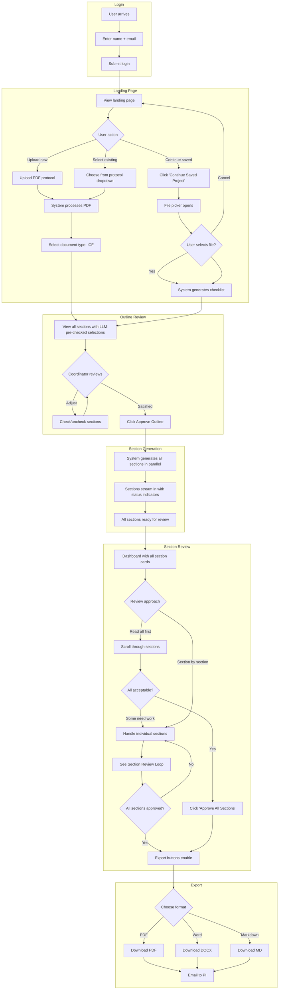
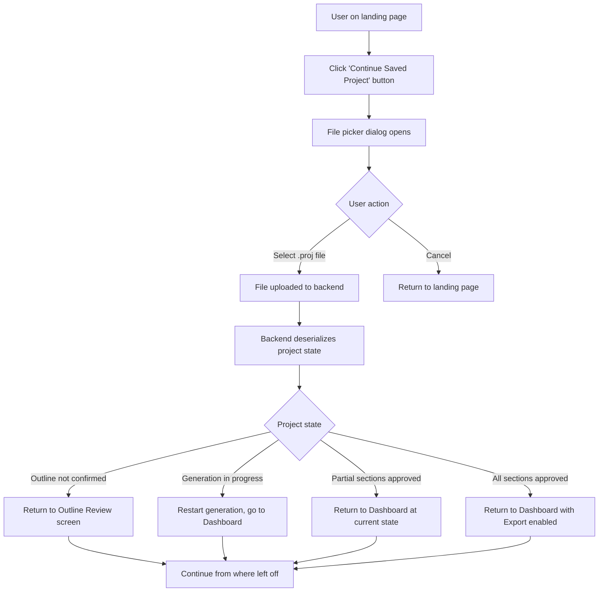
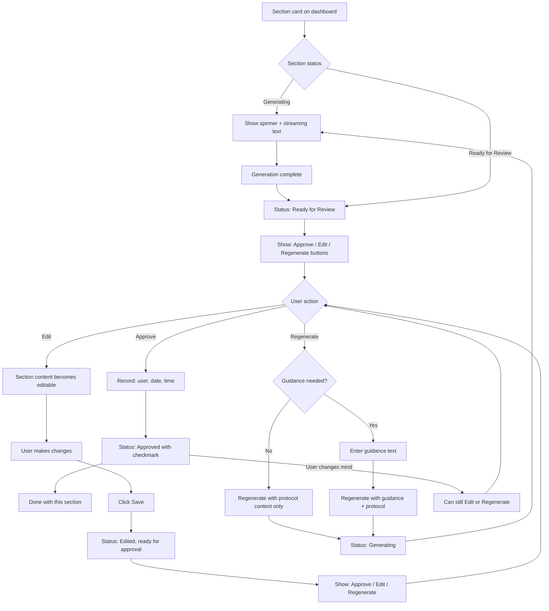

# UX Design Specification: bmad-simple-app

**Author:** Mikey
**Date:** 2026-02-03

---

## Executive Summary

### Project Vision

bmad-simple-app transforms clinical trial ICF creation from a weeks-long manual process into an hours-long AI-assisted review workflow. Research coordinators upload clinical protocol PDFs, and the system uses RAG-based retrieval to generate section-by-section ICF content. The human-in-the-loop approval model maintains regulatory accountability while dramatically reducing time-to-completion.

### Target Users

#### Primary: Research Coordinator

- Domain expert in regulatory compliance and IRB requirements
- Not expected to have medical training or AI prompt engineering skills
- Works across multiple concurrent clinical trials
- Uses desktop primarily, tablet/phone for review tasks

#### Secondary: DCC Supervisor

- Quality gate before PI submission
- Reviews and can edit completed ICFs

#### Downstream: Principal Investigator

- Receives ICF via email (does not interact with application)
- Reviews for medical accuracy and provides signature approval

### Key Design Challenges

1. **Multi-Step Workflow Clarity** - Protocol selection → outline review → section generation → review/approve → export. Each step has different interaction patterns; progress and next-actions must be obvious.

2. **Real-Time Streaming UX** - Sections generate in parallel with streaming text. Status must be glanceable across 10+ sections (generating → ready for review → approved).

3. **Human-in-the-Loop Without Friction** - Every section requires approval for regulatory accountability, but the workflow must feel efficient. "Approve All" for confidence, individual review when needed.

4. **Natural Language Input** - Outline corrections and regeneration guidance via free-text without requiring prompt engineering skills.

### Design Opportunities

1. **Smart Defaults with Override** - AI proposes outlines and generates content; humans always have final control. "AI drafts, human decides" feels empowering.

2. **Confidence Through Transparency** - Word counts, status badges, and approval tracking build trust in the regulated context.

3. **Minimal Clicks for Happy Path** - Most sections approved as-is. Edit and regenerate are escape hatches, not primary interactions.

4. **Extensible Document Type Selection** - Architecture supports future document types beyond ICF.

## Core User Experience

### Defining Experience

The core experience centers on **section-by-section review and approval**. Research coordinators spend most of their time reading AI-generated content and making approve/edit/regenerate decisions. The product succeeds when:

- Good sections are approved in one click
- Edits are made inline with clear save/approve flow
- Regeneration with guidance steers the AI effectively

### Platform Strategy

| Aspect | Decision |
|--------|----------|
| Platform | Web application (MPA with SPA-like dashboard) |
| Primary Device | Desktop workstation |
| Secondary Devices | Tablet (review), Phone (quick access) |
| Browsers | Chrome and Safari |
| Input | Mouse/keyboard primary; touch on mobile |
| Offline | Not required |

### Effortless Interactions

- **Approving a good section** - One click with instant visual feedback
- **Scanning section status** - Glanceable icons and badges across all sections
- **Editing content** - Inline text editing with clear Save → Approve flow
- **Exporting final ICF** - All formats (PDF, Word, Markdown) available once all sections approved

### Critical Success Moments

1. **First section streams in** - User sees real-time progress, builds confidence
2. **Reading generated content** - Quality matches or exceeds manual drafting
3. **Clicking Approve** - Satisfying confirmation of progress
4. **All sections approved** - Export buttons enable; accomplishment achieved
5. **PI approves ICF** - Minimal revisions validate the tool's value

### Experience Principles

1. **Approve is the Happy Path** - Most sections approved as-is. Edit and Regenerate are escape hatches, not primary flows.

2. **Progressive State, Clear Actions** - Each section shows exactly one primary action based on state:
   - Generating → [spinner, no actions]
   - Ready for Review → [Approve] [Edit] [Regenerate]
   - Editing → [Save] [Cancel]
   - Edited (saved) → [Approve] [Edit] [Regenerate]
   - Approved → [Edit] [Regenerate] (can revise if needed)

3. **AI Drafts, Human Decides** - System proposes; coordinator disposes. Every section requires explicit human approval.

4. **Streaming Builds Confidence** - Real-time text generation shows the system working, not a black box.

5. **Responsive Without Compromise** - Full workflow available on any device; section cards adapt without losing functionality.

## Desired Emotional Response

### Primary Emotional Goals

**Empowered Efficiency** - Coordinators should feel they have a capable assistant handling the hard part (medical translation), leaving them to apply their expertise (regulatory compliance, patient-appropriate language).

Supporting emotions:

- **Confidence** - "This content is accurate; I can send it to the PI"
- **Control** - "I can approve, edit, or regenerate any section"
- **Momentum** - "I'm making real progress with every approval"
- **Relief** - "I don't have to write this from scratch anymore"

### Emotional Journey Mapping

| Moment | Desired Emotion | Design Implication |
|--------|-----------------|-------------------|
| Login | Calm, ready | Clean, professional interface |
| Protocol upload | Anticipation | Clear feedback during processing |
| Outline review | In control | Can adjust before committing |
| Generation starts | Excitement | Streaming shows visible progress |
| Reading first section | Impressed | Quality exceeds expectations |
| Approving sections | Satisfaction | Instant visual feedback |
| Bad section encountered | Not worried | Easy edit/regenerate escape hatch |
| All sections approved | Accomplishment | Clear celebration moment |
| Export complete | Pride | Ready to send to PI confidently |

### Micro-Emotions

| Cultivate | Prevent |
|-----------|---------|
| Confidence → Trust the output | Skepticism → "Is this right?" |
| Accomplishment → Progress visible | Frustration → Stuck or confused |
| Control → Can always override AI | Helplessness → AI decides for me |
| Efficiency → Fast workflow | Tedium → Too many clicks |

### Emotional Design Principles

1. **Progress Over Perfection** - Show momentum constantly. Every approval is visible progress. Never let users feel stuck.

2. **Control Without Burden** - AI does heavy lifting; human is always in charge. Override is easy, not an emergency.

3. **Trust Through Transparency** - Word counts, clear status, streaming generation. No black boxes.

4. **Celebrate Completion** - When all sections approved, make it feel like an accomplishment.

## UX Pattern Analysis & Inspiration

### Design Philosophy

bmad-simple-app is a **task-focused utility**, not a platform. Research coordinators already use numerous applications with love-hate relationships. This tool succeeds by being straightforward, transparent, and quick to complete.

**What This App Is:**

- Task-focused tool: get in → generate ICF → get out
- Transparent about what it's doing at every step
- Professional utility for regulated work environment
- Minimal learning curve, self-evident interface

**What This App Is NOT:**

- Another complex system to master
- A place users spend hours daily
- Clever or surprising (users want predictable)
- Feature-rich to the point of confusion

### Anti-Patterns to Avoid

| Anti-Pattern | Why It's Bad | Our Approach |
|--------------|--------------|--------------|
| Feature bloat | Overwhelming, hard to find what you need | Single-purpose screens |
| Hidden functionality | "Where did that button go?" | Visible, predictable actions |
| Engagement tricks | Notifications, badges, gamification | None - tool, not game |
| Complex navigation | Multiple levels, hamburger menus | Linear workflow, clear back |
| Onboarding wizards | Users just want to do the task | Self-evident interface |
| Clever micro-interactions | Distracting, unprofessional | Straightforward feedback |

### Transferable Principles

1. **Single-Purpose Screens** - Each screen does one thing. Protocol selection. Outline review. Section dashboard. Export.

2. **Visible State** - Everything on the surface. No hidden menus, no "advanced" modes.

3. **Linear Workflow** - Clear progression. Users always know where they are and what's next.

4. **Immediate Feedback** - Click approve → section shows approved. No mystery.

5. **Professional Aesthetic** - Clean, calm, trustworthy. Healthcare-appropriate color palette.

### Approval Tracking Requirements

Simple documentation, not complex workflow:

- Each section records: approver name, date, timestamp
- Multiple users can approve different sections on the same project
- All approvers logged and printed on final ICF page
- No approval hierarchy or routing - just transparent record-keeping

## Design System Foundation

### Design System Choice

**Tailwind CSS + Custom React Components** within a Next.js/TypeScript application.

### Technology Stack

| Layer | Choice |
|-------|--------|
| Framework | Next.js |
| Styling | Tailwind CSS (utility-first) |
| Components | Custom React components |
| Language | TypeScript |
| Deployment | Vercel-compatible |

### Rationale for Selection

1. **Prototype Proven** - Stack already validated through iterative prototype development
2. **Claude Code Friendly** - Utility classes and typed components work well with AI-assisted development
3. **No Library Conflicts** - Custom components avoid shadcn/Vercel compatibility issues
4. **Full Control** - No framework constraints on design or behavior
5. **Task-Focused** - Lightweight approach matches tool-not-platform philosophy

### Implementation Approach

- Build reusable components for repeated UI patterns
- Use Tailwind design tokens for consistent spacing, colors, typography
- Keep components single-purpose and composable
- TypeScript interfaces for all component props

### Component Library (To Build)

Core components needed:

- **Layout:** PageHeader, ContentCard, ActionBar
- **Forms:** TextInput, FileUpload, TextArea
- **Feedback:** StatusBadge, Spinner, Toast
- **Section Card:** The primary dashboard component (title, content, status, actions)
- **Buttons:** Primary, Secondary, Destructive variants

### Color Strategy

Current purple/violet palette retained as starting point. Colors defined in Tailwind config for easy adjustment. Healthcare-appropriate: professional, calm, trustworthy.

## Defining User Experience

### The Defining Experience

**"Review AI-generated content and approve it in one click"**

The core interaction that defines bmad-simple-app: coordinators read AI-generated ICF sections and approve them with a single click. If content needs adjustment, they edit or regenerate. This is the loop that delivers value.

User description: "You upload the protocol, and it generates all the ICF sections. You just read through each one and click Approve. If something's wrong, you can edit it or have it regenerate. When you're done, you download the ICF."

### User Mental Model

**Current process (without tool):**

- Open blank document, read protocol, manually write patient-facing language
- Send to PI → wait → receive feedback → revise → repeat for weeks

**Mental model with tool:**

- "I'm the author, the AI is my assistant"
- "I need to verify everything before it goes to the PI"
- "This is my responsibility - I can't blindly trust AI"
- AI does hard part (medical translation); I do quality control (my expertise)

### Success Criteria

| Criteria | Definition |
|----------|------------|
| Instant comprehension | User reads section and immediately knows if it's good |
| One-click approval | If content is good, approve in single click |
| Easy escape hatch | If content is wrong, edit or regenerate without friction |
| Clear progress | Always know what's approved vs. pending |
| Confidence to send | When done, feel confident sending to PI |

### Pattern Analysis

Mostly established patterns with domain-specific application:

| Pattern | Type | Notes |
|---------|------|-------|
| Card-based content layout | Established | Common in dashboards |
| Approve/Edit/Regenerate actions | Established | Similar to PR review |
| Streaming text generation | Emerging | Users familiar from ChatGPT |
| Section-by-section review | Domain-specific | Matches consent document structure |

No major user education needed. Interaction model is intuitive: Read → Decide → Act.

### Experience Mechanics: The Section Card

**1. Initiation:**

- User arrives at dashboard after outline confirmed
- All sections generate in parallel
- Cards appear with streaming text and spinner

**2. Interaction (per section):**

- Generating: Spinner icon, text streaming, no actions
- Ready: Approve button appears (green), Edit and Regenerate available
- User reads and decides:
  - If good → Click Approve → checkmark, "Approved" status
  - If needs edit → Click Edit → text editable → Save → then Approve
  - If bad → Click Regenerate → optional guidance → new generation

**3. Feedback:**

- Status badge updates immediately
- Approved sections show green checkmark
- Word count displayed throughout
- "Approve All Sections" appears when all ready

**4. Completion:**

- All sections approved → Export buttons enable
- Download PDF, Word, or Markdown
- Send to PI. Done.

## Visual Design Foundation

### Color System

**Primary Palette:**

| Role | Color | Tailwind | Usage |
|------|-------|----------|-------|
| Primary | Purple/Violet | `violet-600` | Primary buttons, links, active states |
| Success | Green | `emerald-500` | Approve button, approved status, checkmarks |
| Warning | Amber | `amber-500` | Caution states |
| Error | Red | `red-500` | Error messages, destructive actions |
| Neutral | Slate | `slate-*` | Text, borders, backgrounds |

**Semantic Color Mapping:**

- **Approve action** → Green (success)
- **Edit action** → Neutral/outline (secondary)
- **Regenerate action** → Neutral/outline (secondary)
- **Export PDF** → Red (file type convention)
- **Export Word** → Blue (file type convention)
- **Export Markdown** → Green (file type convention)
- **Status: Generating** → Amber/spinning
- **Status: Ready** → Neutral
- **Status: Approved** → Green with checkmark

### Typography System

**Font Stack:** System fonts (`-apple-system, BlinkMacSystemFont, 'Segoe UI', Roboto, sans-serif`) or Inter

**Type Scale:**

| Element | Size | Weight | Tailwind |
|---------|------|--------|----------|
| Page title | 24-32px | Bold | `text-2xl font-bold` |
| Section title | 18-20px | Semibold | `text-lg font-semibold` |
| Body text | 14-16px | Normal | `text-base` |
| Meta/small | 12-14px | Normal | `text-sm text-slate-500` |
| Button text | 14px | Medium | `text-sm font-medium` |

**Rationale:** System fonts for instant loading and native feel. Users read substantial generated text; readability is critical.

### Spacing & Layout Foundation

**Base Unit:** 4px (Tailwind default)

| Token | Value | Tailwind | Usage |
|-------|-------|----------|-------|
| xs | 4px | `p-1` | Tight internal padding |
| sm | 8px | `p-2` | Button padding, tight gaps |
| md | 16px | `p-4` | Card padding, standard gaps |
| lg | 24px | `p-6` | Section spacing |
| xl | 32px | `p-8` | Page margins |

**Layout Principles:**

- Full-width on mobile, max-width container on desktop (1280px)
- Single column layout for section cards (vertical stack)
- Consistent card styling: rounded corners (`rounded-lg`), subtle shadow, white background
- Generous whitespace between sections for scanability

### Accessibility Considerations

- **Contrast:** All text meets WCAG AA (4.5:1 minimum)
- **Focus states:** Visible ring on keyboard focus (`focus:ring-2`)
- **Status indication:** Icon + text + color (never color alone)
- **Touch targets:** Minimum 44x44px on mobile devices
- **No formal WCAG certification required** but best practices followed

## Design Direction

### Design Direction Decision

**Chosen Direction:** Existing prototype design (validated through iterative development)

The design direction is established through the working prototype, which has been refined over multiple iterations with Claude Code. Rather than exploring alternative visual approaches, we lock in this validated direction.

### Key Design Elements

**Layout Structure:**

- Single-column card stack for section content
- Full-width header with protocol context
- Action bar for bulk operations and export
- Generous whitespace for readability

**Card Design:**

- White background (`bg-white`)
- Rounded corners (`rounded-lg`)
- Subtle shadow (`shadow-sm`)
- Clear section title with status badge
- Content area with word count metadata
- Right-aligned action buttons

**Color Application:**

- Purple/violet gradient for header accents
- Green for approve actions and approved status
- Neutral/outline for secondary actions (Edit, Regenerate)
- Red/blue/green for export buttons (matching file type conventions)

**Interaction Patterns:**

- Streaming text appears during generation
- Spinner indicates generating state
- Buttons enable progressively based on state
- Status badges update immediately on action

### Design Rationale

1. **Prototype Proven** - Design validated through real usage and iteration
2. **Task-Focused** - Clean layout keeps focus on content review
3. **Clear Hierarchy** - Section cards create scannable structure
4. **Progressive Disclosure** - Actions appear when relevant
5. **Professional Aesthetic** - Appropriate for healthcare/regulatory context

### Screens to Design

Building on the prototype direction, the following screens need design:

| Screen | Status | Notes |
|--------|--------|-------|
| Login | New | Simple name + email entry |
| Protocol Selection | Exists | From prototype (InitialScreen) |
| Upload Protocol | Exists | From prototype (uploadProtocol) |
| Document Type Selection | Exists | From prototype (SelectDocType) |
| Outline Review | New | AI-proposed outline with correction input |
| ICF Dashboard | Exists | From prototype (dashboard 1-3) |
| Regenerate with Guidance | New | Modal or inline input for guidance text |
| Project List | New | Resume/continue existing projects |

## User Journey Flows

### New ICF Creation Flow



**Key Decision Points:**

- Landing page has three actions: upload protocol, select protocol, or continue saved project
- No explicit "New vs Continue" choice - user action determines intent
- "Continue Saved Project" opens file picker; cancel returns to landing page
- Loaded projects go directly to Dashboard at their saved state
- Outline review uses checkbox list with LLM pre-selections (not free-text corrections)
- "Approve All Sections" is prominent for batch approval after read-through

### Resume/Continue Project Flow



**State Handling:**

- Projects can be resumed at any stage: outline, partial review, complete
- If project was mid-generation when saved, generation restarts from saved section states
- Dashboard restores to exact previous state
- User manages project files via their file system (shared folders, email, etc.)

**File Format:**

- Project files use `.proj` extension (or `.json`)
- Contains all project state: protocol reference, outline, sections, approvals
- Human-readable JSON format for debugging if needed

### Section Review Loop



**Interaction States:**

- Generating → Ready for Review → Approved
- Edit creates intermediate "Edited" state requiring explicit approval
- Approved sections can still be edited or regenerated if user changes mind

### Flow Optimization Principles

1. **Minimize decisions at entry** - Landing page shows context (existing projects visible) so "New vs Continue" is obvious, not a confusing forced choice

2. **Checklist over free-text for outline** - Structured checkbox list is faster and less error-prone than natural language corrections. LLM does the thinking; coordinator just validates.

3. **"Approve All" is the happy path** - Prominent placement assumes most sections are good. Individual approve buttons are escape hatches, not the primary flow.

4. **Read-first workflow** - Scroll through all → assess → batch approve. This matches how coordinators actually think: "Is this document ready?" not "Is section 1 ready?"

5. **State always visible** - Dashboard shows all sections at once so progress is glanceable. No hidden sections or pagination.

## Component Strategy

### Design System Components

Tailwind CSS provides design tokens (colors, spacing, typography, shadows) but no pre-built components. All components are custom-built using Tailwind utility classes within React/TypeScript.

**Available from Tailwind:**

- Color palette (violet, emerald, amber, red, slate)
- Typography scale (text-sm through text-2xl)
- Spacing scale (p-1 through p-8)
- Shadow utilities (shadow-sm, shadow)
- Border radius (rounded-lg)
- Responsive breakpoints (sm, md, lg)

### Custom Components

#### Section Card

**Purpose:** Display a single ICF section with its content, status, and available actions. This is the primary component users interact with on the dashboard.

**Usage:** Rendered in a vertical stack on the ICF Dashboard. One card per section (10-15 sections typical).

**Anatomy:**

```
┌─────────────────────────────────────────────────────────────┐
│ [Status Badge]  Section Title                    Word Count │
├─────────────────────────────────────────────────────────────┤
│                                                             │
│  Section content text...                                    │
│  (Streaming text appears here during generation)            │
│  (Editable when in Edit mode)                               │
│                                                             │
├─────────────────────────────────────────────────────────────┤
│                          [Regenerate] [Edit] [Approve]      │
└─────────────────────────────────────────────────────────────┘
```

**States:**

| State | Status Badge | Content Area | Actions Available |
|-------|--------------|--------------|-------------------|
| Generating | Amber spinner + "Generating" | Streaming text, not editable | None |
| Ready for Review | Neutral "Ready" | Static text, not editable | Approve, Edit, Regenerate |
| Editing | Neutral "Editing" | Editable textarea | Save, Cancel |
| Edited (unsaved) | Neutral "Edited" | Static text showing edits | Approve, Edit, Regenerate |
| Approved | Green checkmark + "Approved" | Static text, not editable | Edit, Regenerate (can revise) |
| Regenerating | Amber spinner + "Regenerating" | Previous text fades, new streams in | None |
| Error | Red "Error" | Error message | Retry, Edit manually |

**Variants:**

- **Default** - Standard card for most sections
- **Collapsed** - Shows only header row (title + status + word count) for long documents; click to expand
- **Expanded** - Full content visible (default state)

**Accessibility:**

- `role="article"` with `aria-labelledby` pointing to section title
- Status badge includes `aria-live="polite"` for state changes
- Approve button: `aria-label="Approve [Section Name]"`
- Edit button: `aria-label="Edit [Section Name]"`
- Regenerate button: `aria-label="Regenerate [Section Name]"`
- When editing: textarea has `aria-label="Edit content for [Section Name]"`
- Keyboard: Tab through action buttons, Enter to activate

**Content Guidelines:**

- Section title comes from outline (e.g., "Purpose of the Study", "Risks and Discomforts")
- Word count updates in real-time during streaming
- Content is markdown-rendered for readability (paragraphs, lists)
- Maximum content height with scroll for very long sections

**Interaction Behavior:**

- **Generating:** Text streams in character-by-character or chunk-by-chunk. Spinner animates. No user interaction possible.
- **Approve click:** Instant status change to Approved. Green checkmark appears. Records user/date/time.
- **Edit click:** Content area becomes editable textarea. Save and Cancel buttons replace action buttons.
- **Save click:** Exits edit mode. Status shows "Edited". Approve button available.
- **Cancel click:** Discards changes. Returns to previous state.
- **Regenerate click:** Opens guidance input (inline or modal). Submit triggers regeneration.

#### Outline Checklist

**Purpose:** Display all possible ICF sections as a checkbox list. LLM pre-checks recommended sections based on protocol analysis. Coordinator checks/unchecks to finalize the outline before generation.

**Usage:** Rendered on the Outline Review screen after protocol processing. Single use per ICF project.

**Anatomy:**

```
┌─────────────────────────────────────────────────────────────┐
│  Proposed ICF Outline                                       │
│  Based on protocol analysis, we recommend these sections:   │
├─────────────────────────────────────────────────────────────┤
│                                                             │
│  STANDARD SECTIONS                                          │
│  ☑ Purpose of the Study                                     │
│  ☑ Study Procedures                                         │
│  ☑ Risks and Discomforts                                    │
│  ☑ Benefits                                                 │
│  ☑ Alternatives                                             │
│  ☑ Confidentiality                                          │
│  ☑ Costs and Compensation                                   │
│  ☑ Voluntary Participation                                  │
│  ☑ Contact Information                                      │
│                                                             │
│  CONDITIONAL SECTIONS                                       │
│  ☑ Genetic Research (detected: genetic sample collection)   │
│  ☐ Sample Storage (not detected)                            │
│  ☐ HIV Testing (not detected)                               │
│                                                             │
│  SIGNATURE PAGES                                            │
│  ☑ Adult Consent Signature                                  │
│  ☑ Teen Assent Signature (detected: ages 16-17)             │
│  ☐ Parent/Guardian Permission (not detected)                │
│                                                             │
├─────────────────────────────────────────────────────────────┤
│                                        [Approve Outline]    │
└─────────────────────────────────────────────────────────────┘
```

**States:**

| State | Description | Actions Available |
|-------|-------------|-------------------|
| Default | Checkboxes reflect LLM recommendations | Check/uncheck any item, Approve Outline |
| Modified | User has changed from LLM defaults | Check/uncheck any item, Approve Outline |
| Approved | Outline confirmed, proceeding to generation | None (navigates to Dashboard) |

**Variants:**

- **Grouped** (default) - Sections organized by category (Standard, Conditional, Signatures)
- **Flat** - All sections in single list (if categories not useful)

**Accessibility:**

- `role="group"` with `aria-labelledby` for each category heading
- Each checkbox: standard `<input type="checkbox">` with associated `<label>`
- Detection notes use `aria-describedby` to associate with checkbox
- Keyboard: Tab between checkboxes, Space to toggle
- Approve button: `aria-label="Approve outline and begin generation"`

**Content Guidelines:**

- Section names match final ICF section titles
- Detection notes explain why LLM checked/unchecked (e.g., "detected: genetic sample collection")
- Categories help users scan: Standard (always included), Conditional (protocol-dependent), Signatures (audience-dependent)
- Clear heading explains this is a recommendation, not final

**Interaction Behavior:**

- **Page load:** LLM recommendations pre-checked. User reviews.
- **Checkbox click:** Toggles checked state. No auto-save.
- **Approve Outline click:** Confirms selections. Navigates to Dashboard. Triggers parallel section generation.

#### Project Card

**Status:** REMOVED

**Reason:** With local file-based project storage, there is no central project list to display. Users manage project files via their file system and use the "Continue Saved Project" button with a file picker to open projects.

**Alternative:** If future requirements call for "recent files" functionality, a simplified "Recent Projects" component could display the last few opened files (stored in localStorage). This is deferred to post-MVP.

#### Action Bar

**Purpose:** Provide bulk actions, project save, and export options on the Dashboard. Houses the prominent "Approve All Sections" button, "Save Project" button, and export buttons.

**Usage:** Fixed or sticky at top of Dashboard page only. Always visible while reviewing sections.

**Anatomy:**

```
┌─────────────────────────────────────────────────────────────┐
│  [Approve All Sections]   [Save Project]   [PDF] [Word] [MD]│
│                                                             │
│  Progress: ████████░░ 8/12 approved                         │
└─────────────────────────────────────────────────────────────┘
```

**States:**

| State | Approve All | Save Project | Export Buttons | Progress |
|-------|-------------|--------------|----------------|----------|
| Generating | Disabled | Disabled | Disabled | "Generating..." |
| All generated, none approved | Enabled, green | Enabled | Disabled | "0/12 approved" |
| Partial approved | Enabled, green | Enabled | Disabled | "8/12 approved" |
| All approved | Hidden or "All Approved ✓" | Enabled | Enabled, colored | "12/12 approved ✓" |

**Button Specifications:**

| Button | Style | Behavior |
|--------|-------|----------|
| Approve All Sections | Green filled, prominent | Approves all "Ready" sections |
| Save Project | Outline/secondary | Downloads project JSON file to local system |
| PDF | Red icon | Exports final ICF as PDF |
| Word | Blue icon | Exports final ICF as DOCX |
| MD | Green icon | Exports final ICF as Markdown |

**Save Project Behavior:**

- Enabled only after all sections have completed generation (no streaming in progress)
- Disabled during generation to prevent saving incomplete/undefined state
- Click triggers download of project file (`.proj` or `.json`)
- File contains complete project state for later resume
- No confirmation dialog needed (non-destructive action)

**Note:** Save Project is available only on the Dashboard page. The landing page has "Continue Saved Project" to open files.

**Variants:**

- **Sticky** (default) - Stays at top of viewport while scrolling
- **Static** - Scrolls with page (for simpler implementation)

**Accessibility:**

- `role="toolbar"` with `aria-label="Section actions and export"`
- Approve All: `aria-label="Approve all sections"` + `aria-disabled` when disabled
- Export buttons: `aria-label="Export as PDF"`, etc.
- Progress bar: `role="progressbar"` with values
- Keyboard: Tab between buttons, Enter to activate

**Content Guidelines:**

- "Approve All Sections" is the primary action - largest, green, leftmost
- Export buttons use file-type colors (PDF=red, Word=blue, Markdown=green)
- Progress shows fraction approved out of total
- When all approved, celebrate: checkmark, "All Approved" state

**Interaction Behavior:**

- **Approve All click:** Approves all sections that are in "Ready for Review" state. Records user/date/time for each. Progress jumps to 100%.
- **Export click (when enabled):** Downloads file in selected format. Includes approval tracking page.
- **Disabled state:** Buttons appear grayed, cursor shows not-allowed, click does nothing
- **Sticky behavior:** Bar stays visible at top of viewport; shadow appears when scrolled

### Supporting Components

#### Button

**Variants:**

- **Primary** - Green, filled (`bg-emerald-500 text-white`) - Approve actions
- **Secondary** - Outline (`border border-slate-300 text-slate-700`) - Edit, Regenerate
- **Destructive** - Red, filled (`bg-red-500 text-white`) - Delete, Cancel destructive action
- **Export PDF** - Red icon + text
- **Export Word** - Blue icon + text
- **Export Markdown** - Green icon + text

**Sizes:** `sm` (tight padding), `md` (default), `lg` (prominent actions)

**States:** Default, Hover, Active, Disabled, Loading (with spinner)

#### Status Badge

**Variants:**

- **Generating** - Amber background, spinner icon, "Generating" text
- **Ready** - Slate/neutral background, "Ready for Review" text
- **Approved** - Green background, checkmark icon, "Approved" text
- **Edited** - Slate background, "Edited" text
- **Error** - Red background, warning icon, "Error" text

#### Text Input

**Usage:** Login (name, email), Regenerate guidance

**States:** Default, Focus, Error, Disabled

**Variants:** Single-line input, Multi-line textarea (for guidance)

#### File Upload

**Usage:** Protocol upload

**States:** Default (drop zone), Dragging over, Uploading (progress), Complete, Error

#### Spinner

**Usage:** Generating state in Section Card, loading states

**Sizes:** `sm` (inline with text), `md` (standalone)

#### Page Header

**Anatomy:**

```
┌─────────────────────────────────────────────────────────────┐
│  [← Back]  Page Title                          [User Name]  │
│            Subtitle or context                  [Logout]    │
└─────────────────────────────────────────────────────────────┘
```

### Component Implementation Roadmap

**Phase 1 - Core Components (MVP Critical Path):**

1. **Section Card** - Required for Dashboard (core experience)
2. **Action Bar** - Required for Dashboard (Approve All + Save Project + Export)
3. **Button** - Required everywhere
4. **Status Badge** - Required for Section Card

**Phase 2 - Flow Components:**

5. **Outline Checklist** - Required for Outline Review screen
6. **File Upload** - Required for Protocol Upload screen
7. **Text Input** - Required for Login + Regenerate guidance
8. **Page Header** - Required for all screens

**Phase 3 - Landing Page:**

9. **Protocol Selector** - Dropdown for existing protocols
10. **Continue Saved Project Button** - Opens file picker dialog
11. **Spinner** - Enhancement for loading states

**Removed Components:**

- **Project Card** - No longer needed (no central project list)
- **Project List** - No longer needed (users manage files locally)

## UX Consistency Patterns

### Button Hierarchy

**Action Bar Buttons (Dashboard top):**

| Button | Style | State Logic |
|--------|-------|-------------|
| Approve All Sections | Large, green filled, prominent | Enabled when ≥1 section is "Ready for Review"; Hidden or shows "All Approved ✓" when complete |
| PDF | Red icon+text, outline | Disabled until all sections approved |
| Word | Blue icon+text, outline | Disabled until all sections approved |
| Markdown | Green icon+text, outline | Disabled until all sections approved |

**Section Card Buttons:**

| Button | Style | Position |
|--------|-------|----------|
| Approve | Green filled, primary | Rightmost (primary action) |
| Edit | Slate outline, secondary | Middle |
| Regenerate | Slate outline, secondary | Leftmost |

**Button States:**

| State | Visual Treatment |
|-------|------------------|
| Default | Standard colors as defined |
| Hover | Slightly darker background, cursor pointer |
| Active/Pressed | Darker still, slight scale down |
| Disabled | Grayed out (`opacity-50`), `cursor-not-allowed` |
| Loading | Spinner replaces icon, text unchanged, disabled interaction |

**Button Sizing:**

- Action Bar: `lg` size (more padding, larger text)
- Section Card: `md` size (default)
- Mobile: minimum 44x44px touch target

### Feedback Patterns

**Success Feedback:**

| Trigger | Feedback |
|---------|----------|
| Section approved | Status badge instantly changes to green "Approved" with checkmark; no toast needed |
| All sections approved | Export buttons enable; subtle celebration (badge glow or confetti optional) |
| Export complete | Browser download starts; toast "Downloaded [filename]" |

**Error Feedback:**

| Trigger | Feedback |
|---------|----------|
| Generation fails | Status badge shows red "Error"; error message in content area; "Retry" button appears |
| Network error | Toast at top: "Connection lost. Retrying..." with auto-retry |
| Save fails | Toast: "Failed to save. Please try again." with manual retry |

**Loading/Progress Feedback:**

| Trigger | Feedback |
|---------|----------|
| Section generating | Amber spinner in status badge; streaming text in content area |
| Bulk approve in progress | Each section updates individually as approved (ripple effect down the list) |
| File uploading | Progress bar in upload component |

**Feedback Principles:**

1. **Inline over toast** - Status changes happen in-place (badges update) rather than toast notifications
2. **Toast for global events** - Network errors, download complete, save failures
3. **No confirmation dialogs** - Actions are reversible (can edit after approve), so no "Are you sure?"
4. **Immediate visual change** - Click → instant feedback, no waiting

### State Transition Patterns

**Section State Machine:**

```
┌──────────────┐
│  Generating  │ ──(complete)──→ ┌─────────────────────┐
└──────────────┘                 │  Ready for Review   │
       ↑                         └─────────────────────┘
       │                                │    │    │
       │                         (approve) (edit) (regenerate)
       │                                │    │    │
       │                                ↓    │    │
       │                         ┌──────────┐│    │
       │                         │ Approved ││    │
       │                         └──────────┘│    │
       │                              │ ↑    │    │
       │                        (edit)│ │    │    │
       │                              ↓ │    ↓    │
       │                         ┌──────────┐     │
       │                         │ Editing  │     │
       │                         └──────────┘     │
       │                              │           │
       │                          (save)          │
       │                              ↓           │
       │                         ┌──────────┐     │
       │                         │  Edited  │←────┘ (cancel returns to previous)
       │                         └──────────┘
       │                              │
       └──────────(regenerate)────────┘
```

**Transition Animations:**

| Transition | Animation |
|------------|-----------|
| Generating → Ready | Spinner fades, badge color shifts to neutral |
| Ready → Approved | Badge flashes green briefly, checkmark appears |
| Any → Editing | Content area gains border/focus ring, becomes textarea |
| Editing → Edited | Border removes, content shows as static |
| Any → Generating | Previous content fades, spinner appears, new text streams |

**Transition Timing:**

- Badge color changes: instant (0ms)
- Icon changes: 150ms fade
- Content area mode switch: 200ms
- Streaming text: appears as received (no artificial delay)

### Empty & Loading States

**Empty States:**

| Context | Message | Action |
|---------|---------|--------|
| No projects yet | "No ICF projects yet. Start by uploading a protocol." | [New Project] button |
| No protocols uploaded | "Upload a clinical protocol to get started." | [Upload Protocol] button |
| Dashboard before generation | Skeleton cards or "Generating sections..." message | None (auto-proceeds) |

**Loading States:**

| Context | Treatment |
|---------|-----------|
| Page loading | Skeleton UI matching final layout (gray placeholder boxes) |
| Project list loading | Skeleton project cards |
| Protocol processing | Progress indicator: "Processing protocol... (this may take a moment)" |
| Section generation | Real cards with streaming content (not skeleton) |

**Skeleton Principles:**

- Match final layout shape (card outlines, text line placeholders)
- Subtle pulse animation
- No spinners for page-level loading (spinners for inline actions only)

### Modal Patterns

**When to Use Modals:**

- Regenerate with guidance - Modal with textarea for guidance input

**Regenerate Modal:**

```
┌─────────────────────────────────────────────────────────────┐
│  Regenerate: [Section Name]                            [X]  │
├─────────────────────────────────────────────────────────────┤
│                                                             │
│  How would you like this section improved?                  │
│                                                             │
│  Tell the AI what to change - tone, missing details,        │
│  specific wording, or anything else. The AI will use        │
│  this guidance along with the protocol to regenerate.       │
│                                                             │
│  Leave blank to regenerate without specific guidance.       │
│                                                             │
│  ┌─────────────────────────────────────────────────────┐    │
│  │                                                     │    │
│  │                                                     │    │
│  └─────────────────────────────────────────────────────┘    │
│  Examples: "Make this more reassuring" • "Add the           │
│  injection site reactions from page 34" • "Simpler          │
│  language for patients"                                     │
│                                                             │
├─────────────────────────────────────────────────────────────┤
│                                   [Cancel]    [Regenerate]  │
└─────────────────────────────────────────────────────────────┘
```

**Modal Behavior:**

- Centered on screen with backdrop overlay
- Click outside or X to close (same as Cancel)
- Escape key closes
- Focus trapped inside modal
- Primary action (Regenerate) on right, secondary (Cancel) on left
- Regenerate works with or without guidance text

### Form Patterns

**Login Form:**

- Two fields: Name (text), Email (email)
- Single "Continue" button
- No validation beyond required fields and email format
- Error shown inline below field

**Guidance Input (in modal):**

- Single textarea
- No placeholder text (helper text above explains purpose)
- Optional (can submit empty)
- Examples shown below textarea as hints

**Form Principles:**

- Labels above fields
- Error messages below fields, red text
- Required fields marked with asterisk (if any optional fields exist)
- Submit button disabled until required fields valid

### Navigation Patterns

**Linear Workflow:**

```
Login → Landing → Protocol Selection → Outline Review → Dashboard → (Export)
```

**Back Navigation:**

- Browser back button works naturally (each step is a route)
- Explicit "← Back" link in page header where contextually useful
- Dashboard has no back (it's the destination)

**Header Navigation:**

- User name displayed in header
- Logout available from any screen
- No hamburger menu or complex navigation

## Responsive Design & Accessibility

### Responsive Strategy

**Desktop (Primary - 1024px+):**

| Element | Desktop Treatment |
|---------|-------------------|
| Section Cards | Full width within max-width container (1280px) |
| Action Bar | Sticky at top, full button labels |
| Content | Generous whitespace, comfortable reading width |
| Navigation | Header with user info visible |

**Tablet (Secondary - 768px-1023px):**

| Element | Tablet Treatment |
|---------|------------------|
| Section Cards | Full width, slightly reduced padding |
| Action Bar | Sticky, buttons may stack if needed |
| Content | Reduced margins, still readable |
| Touch targets | Minimum 44x44px enforced |

**Mobile (Tertiary - 320px-767px):**

| Element | Mobile Treatment |
|---------|------------------|
| Section Cards | Full width, vertical stacking, collapsible |
| Action Bar | Sticky, "Approve All" full width, export buttons in row below |
| Content | Single column, reduced padding |
| Buttons | Full width for primary actions |

**Key Adaptations:**

1. **Section Card on mobile:** Collapsed by default showing only title + status + word count. Tap to expand and see full content.
2. **Action Bar on mobile:** Stacks vertically - "Approve All" on top, export buttons in row below.
3. **Outline Checklist on mobile:** Full width checkboxes, larger touch targets.
4. **Modal on mobile:** Full-screen takeover instead of centered overlay.

### Breakpoint Strategy

Using Tailwind's default breakpoints (mobile-first):

| Breakpoint | Width | Target |
|------------|-------|--------|
| Default | 0-639px | Mobile phones |
| `sm` | 640px+ | Large phones, small tablets |
| `md` | 768px+ | Tablets |
| `lg` | 1024px+ | Desktop |
| `xl` | 1280px+ | Large desktop (max container width) |

**Mobile-First Approach:**

- Base styles target mobile
- Layer on complexity at larger breakpoints
- Ensures mobile experience is never an afterthought

### Accessibility Strategy

**Compliance Level:** WCAG 2.1 Level AA (best practices, not certified)

This matches the PRD requirement: "No formal WCAG compliance requirements for MVP. Standard web development best practices will be followed."

**Key Accessibility Features:**

| Requirement | Implementation |
|-------------|----------------|
| Color contrast | 4.5:1 minimum for text (Tailwind defaults meet this) |
| Focus indicators | Visible `focus:ring-2` on all interactive elements |
| Keyboard navigation | Tab through all actions, Enter to activate |
| Screen readers | Semantic HTML, ARIA labels on buttons and status changes |
| Status announcements | `aria-live="polite"` on status badges |
| Touch targets | Minimum 44x44px on mobile |
| No color-only meaning | Status uses icon + text + color |

**Specific Component Accessibility:**

| Component | Accessibility Treatment |
|-----------|------------------------|
| Section Card | `role="article"`, `aria-labelledby` for title |
| Status Badge | `aria-live="polite"` announces changes |
| Action buttons | `aria-label="[Action] [Section Name]"` |
| Modal | Focus trap, Escape to close, `role="dialog"` |
| Progress bar | `role="progressbar"` with min/max/current |
| Checkboxes | Standard `<input>` with associated `<label>` |

### Testing Strategy

**Responsive Testing:**

| Method | Scope |
|--------|-------|
| Chrome DevTools | Quick viewport testing during development |
| Real devices | iPhone, iPad, Android phone (if available) |
| BrowserStack | Cross-browser/device testing if needed |

**Browser Testing:**

| Browser | Priority |
|---------|----------|
| Chrome (Mac/Windows) | Primary |
| Safari (Mac/iOS) | Primary |
| Firefox | Not required |
| Edge | Not required |

**Accessibility Testing:**

| Method | When |
|--------|------|
| Keyboard-only navigation | During development |
| VoiceOver (Mac/iOS) | Before release |
| axe DevTools extension | Automated checks during development |
| Manual contrast check | On new color additions |

No formal user testing with assistive technology users required for MVP.

### Implementation Guidelines

**Responsive Development:**

```css
/* Mobile-first approach */
.section-card {
  @apply w-full p-4;           /* Mobile default */
}

@screen md {
  .section-card {
    @apply p-6;                /* Tablet: more padding */
  }
}

@screen lg {
  .section-card {
    @apply p-8;                /* Desktop: generous padding */
  }
}
```

**Key Responsive Rules:**

1. Use `max-w-7xl mx-auto` for container (1280px max)
2. Use `px-4 sm:px-6 lg:px-8` for consistent edge margins
3. Stack buttons vertically on mobile with `flex-col sm:flex-row`
4. Use `text-sm sm:text-base` for font size scaling

**Accessibility Development:**

1. **Semantic HTML first** - `<button>`, `<input>`, `<label>`, not divs with click handlers
2. **ARIA only when needed** - supplement, don't replace, semantic HTML
3. **Focus management** - return focus to trigger element when modal closes
4. **Skip link** - "Skip to main content" link at top (optional for internal tool)

**Component Checklist (before shipping):**

- [ ] Keyboard navigable (Tab, Enter, Escape)
- [ ] Focus visible on all interactive elements
- [ ] Color contrast passes (4.5:1)
- [ ] Touch targets ≥44px on mobile
- [ ] Screen reader announces state changes
- [ ] Works without JavaScript for critical content (progressive enhancement where feasible)
